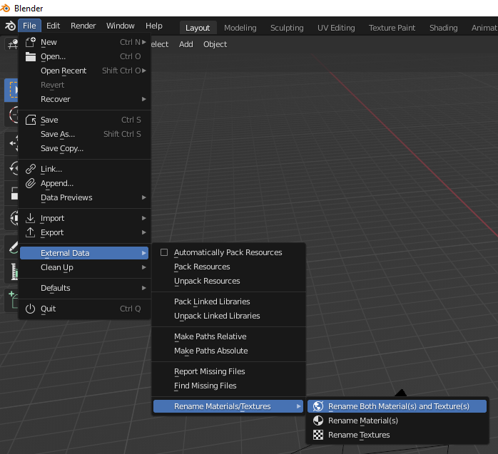

# Rename Materials and Textures
A really quick Blender addon to rename "hidden" packed textures. It can rename materials after the object they're on and textures after the materials they are attached to.

## Getting started
Download `rename_materials_textures.py`to your computer and install it in Blender via `Edit > Preferences > Addons > Install...`. You're ready to go!

## Usage
The renaming operation can be found at `File > External Data > Rename Materials/Textures`.

From here, you can choose to rename either textures or materials or both. Note that the operator only handles selected objects!